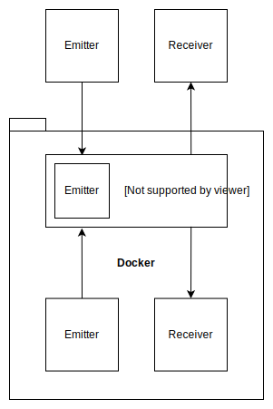

# signalr-between-docker-containers
A PoC to validate if it is possible to communicate between docker containers using SignalR

# What are we testing?

Is it possible to send and receive messages using SignalR?

# The test setup

# Running the example

Running this example will require the [SwitchStartupProject](https://marketplace.visualstudio.com/items?itemName=vs-publisher-141975.SwitchStartupProject) visual studio plugin and a docker setup. Using if you are running OSX or Windows "docker-for-<your os> would be the obvious choice here. Select the profile you would like to test and hit the play button.